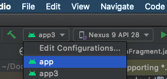

# android塾サンプルアプリ

## app
```
SchoolApp2
├── app   # 第2回サンプルアプリ
├── app3  # 第3回サンプルアプリ
```

## 実行
### Android Studioでビルドする場合
Run configurationから切り替えることができます


### terminalでビルドする場合
```shell script
./gradlew assembleDebug
# または
./gradlew aDebug
```
で全アプリのビルドが行われます。
`aDebug`はgradleタスクの[省略表記](https://gradle.github.io/gradle-script-kotlin-docs/userguide/tutorial_gradle_command_line.html#sec:task_name_abbreviation)です。
```shell script
./gradlew :app3:assembleDebug
```
の形式でアプリごとにビルドできます。

端末へのインストールまで行う場合は
```shell script
./gradlew :app3:installDebug
# または
./gradlew :app3:iD
```
